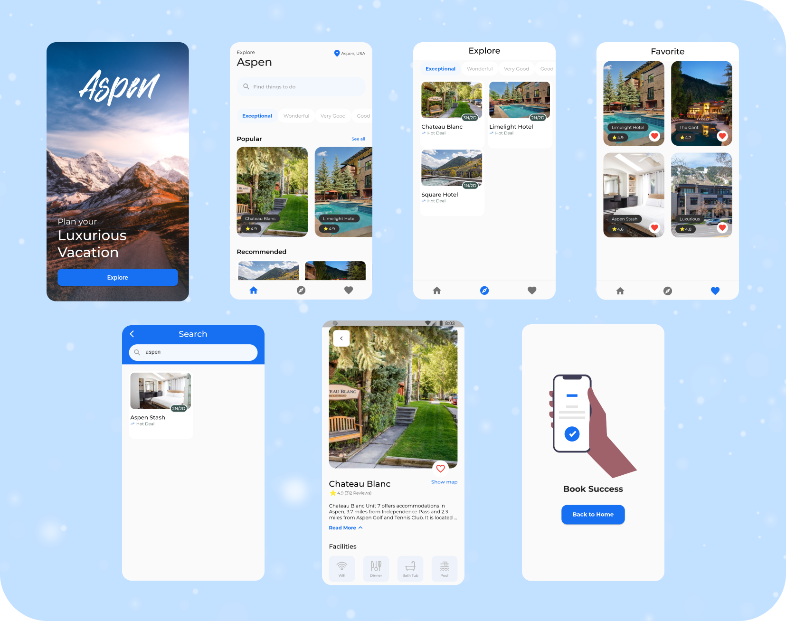

# Explore Aspen App



## Description

Explore Aspen is a lodging search application in the city of Aspen, USA. In this application there are search, recommendation and favorite features. This application can also display detailed information from each lodging such as image, name, rating, description and price.

This application is the first application that I made using Flutter and is the result of a project that I used as a submission in one of the online training classes.

## Design

The design used in this application is a design from [Nickelfox Design](https://www.figma.com/@nickelfox) in Figma Community.
[Aspen Travel App Exploration - Mobile App Design](https://www.figma.com/community/file/1091615514005406765)

## Data

This application still uses dummy data stored in the `lib/model` folder.

## Dependencies

This app is built with some additional packages:

-   [flutter_svg 2.0.7](https://pub.dev/packages/flutter_svg)
-   [google_fonts 5.1.0](https://pub.dev/packages/google_fonts)

## Development

If you want to try to do the development process, make sure your device has installed [flutter](https://flutter.dev/).

You can download this repository by clicking `<> Code` at the top, then selecting `Download ZIP` or if you want to clone this repository you can do this by

```bash
git clone https://github.com/fajarhidayatt/explore-aspen.git
```

After that, install all the packages / dependencies contained in this project

```bash
flutter pub get
```

Then run the application

```bash
flutter run
# or press f5 if you're using VS Code
```
